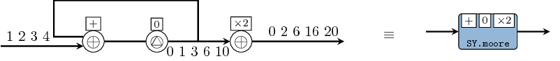

# Overview

The [ForSyDe-Atom]() project is a spin-off from the [ForSyDe-Shallow]({{site.parent-url}}/forsyde-shallow) library, which further explores the power of functional programming as a system design paradigm. It is a pure functional framework for describing, analyzing and simulating cyber-physical systems (CPS) as *networks of processes* communicating through *signals*, and makes heavy use of concepts like [applicative functors](https://wiki.haskell.org/Applicative_functor) and [type classes](https://en.wikibooks.org/wiki/Haskell/Classes_and_types). 

Excerpt from [Ungureanu and Sander, (2017)](https://forsyde.github.io/publications_bib.html#UngMed2018a):

> The purity inherent from describing behavior as *side-effect free* functions ensures that each and every entity is independent and contains self-sufficient semantics, enabling both the modeling and the simulation of *true concurrency* without the need of a global state or controller. Binding together concepts from a wide pool of formalisms this *unified* framework exhibits three essential properties: 
> 1. it slices processes in *structured enclosing **layers*** abstracting different behavioural aspects, as an embodiment of separation of concerns; 
> 1. it provides *primitive, indivisible building blocks* for each layer, named ***atoms***, as the outcome of deconstructing the abstract semantics to their core; 
> 1. it describes composition in terms of ***patterns*** of building blocks, as a means of both modeling complex behavior within a layer, as well as abstracting it in a hierarchical manner. We demonstrate the potential for modeling, analysis and synthesis through a comprehensible example.

The layered process model.

# Quick-start for the impatient

If you cannot wait to get your hands dirty with ForSyDe-Atom, follow the instructions below. Otherwise we do recommend you to take it easy and [discover the full features](#documentation-and-resources) of this EDSL.

Before you try anything, make sure you have [Haskell Platform](https://www.haskell.org/platform/) installed on your machine. Once this is done, get the `forsyde-atom` package through any means suit you best, e.g. by cloning the [repository](https://github.com/forsyde/forsyde-atom) or by downloading and extracting one of the archives above.

Installing the package is as simple as typing in the terminal:

    cd path/to/forsyde-atom
	cabal install
	
You need to be patient until the installation finishes. Afterwards you can start a new interpreter session

    ghci

and import the newly installed libraries and try them out

    Prelude> import ForSyDe.Atom
	Prelude ForSyDe.Atom> import ForSyDe.Atom.MoC.SY as SY
    Prelude ForSyDe.Atom SY> let s = SY.signal [1..4]
    Prelude ForSyDe.Atom SY> SY.moore11 (+) (*2) 0 s
	{0,2,6,12,20}

The example above implements a Moore finite state machine that calculates the running sum and multiplies the output with 2. It instantiates the [`moore`](api/ForSyDe-Atom-MoC.html#v:moore22) pattern with one input and one output (as seen below) with the [synchronous (SY) MoC semantics](api/ForSyDe-Atom-MoC-SY.html) using the [`SY.moore11`](http://localhost:4000/api/ForSyDe-Atom-MoC.html#v:moore22) helper. 

The atom pattern of a Moore state machine.

# Documentation and resources

Here you can find links to further documentation resources:

 * [**The setup page**](setup) contains detailed instructions on how to install and use the libraries.

 * [**The ForSyDe-Atom User Manual**](assets/manual.pdf) is a living document built mainly from the literate sources in the [`forsyde-atom`](https://github.com/forsyde/forsyde-atom) and [`forsyde-atom-examples`](https://github.com/forsyde/forsyde-atom-examples) repositories.

 * [**Some scientific publications**](publications) about ForSyDe-Atom.

 * [**The API documentation**](api) generated with Haddock.

 * [**The `forsyde-atom-examples` repository**](https://github.com/forsyde/forsyde-atom-examples) contain examples and documented experients in form of Haskell packages wuth [literate code](https://en.wikipedia.org/wiki/Literate_programming).

